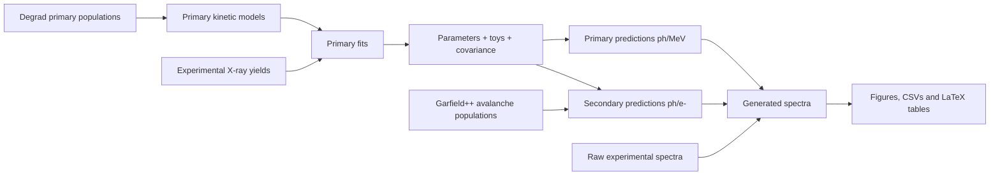
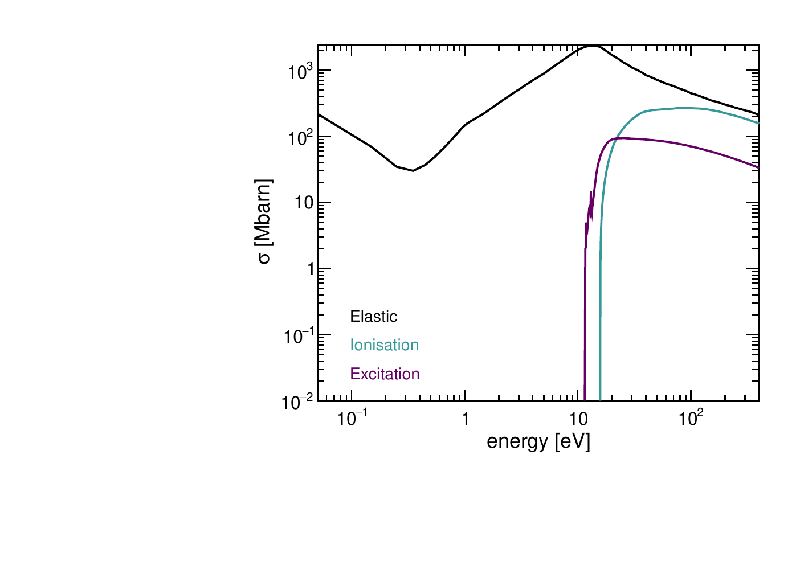
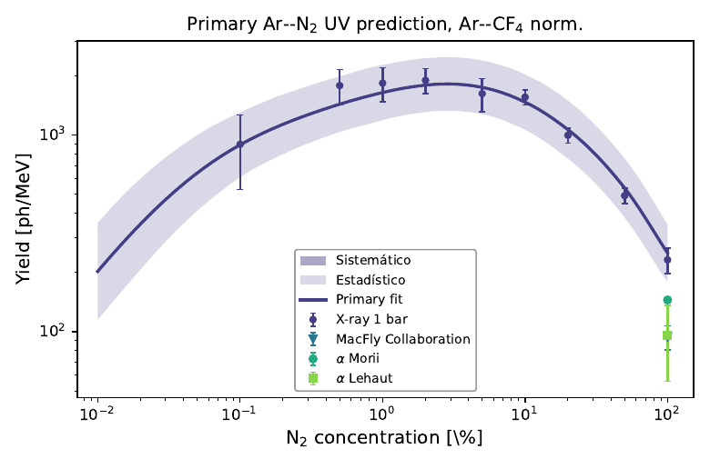
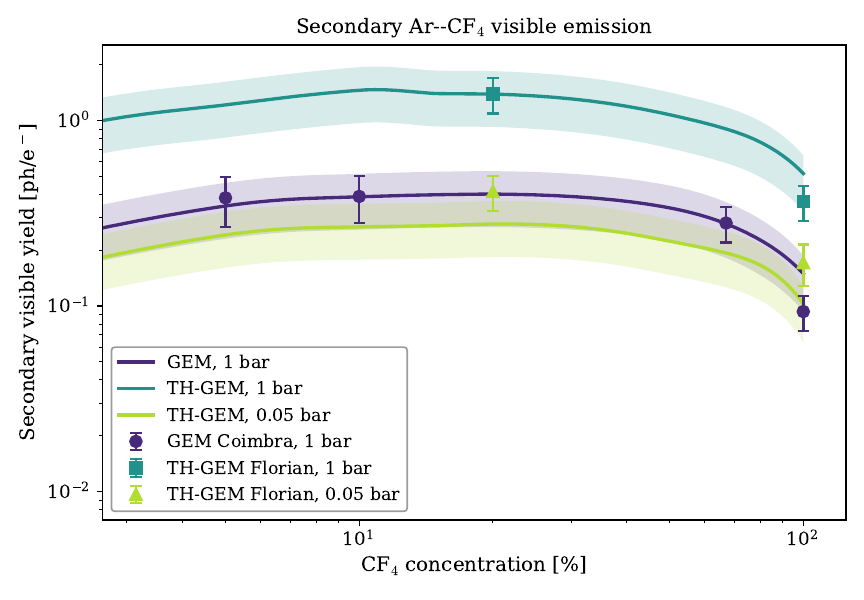
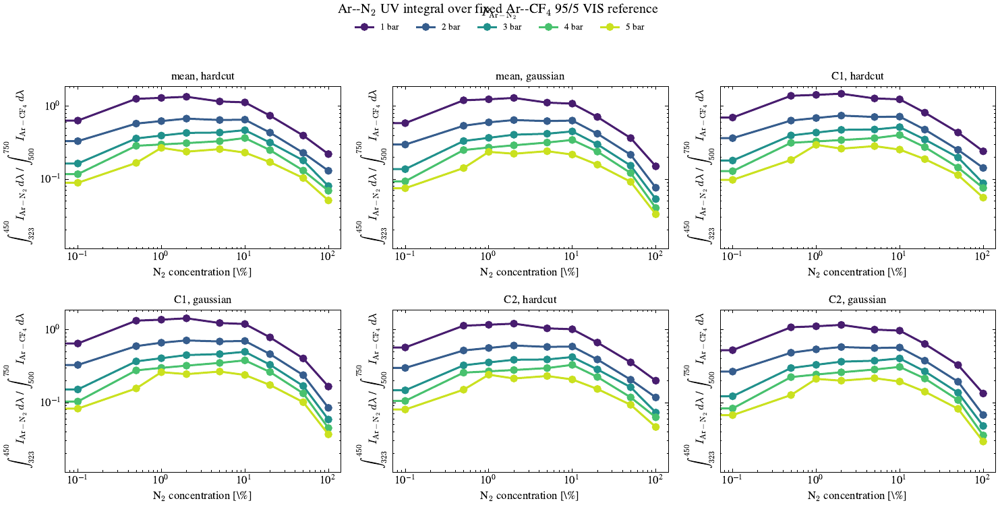
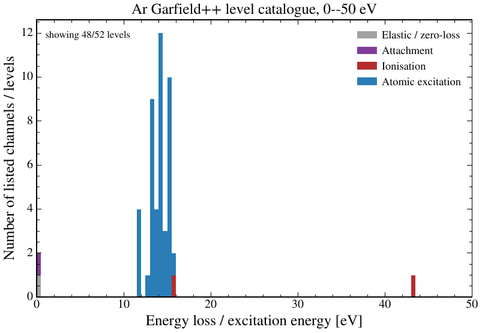

# ScintillationModel Rare Gas Mixtures

Phenomenological scintillation-modeling framework for rare-gas mixtures, with emphasis on primary and secondary light production in Ar--CF$_4$, Ar--N$_2$ and related detector gases. The project combines microscopic population inputs from Degrad/Garfield++ with kinetic emission models, fit machinery, uncertainty propagation, spectral synthesis and paper-ready plots/tables for a TFM-style analysis.

<p align="center">
  
</p>

## What this repository does

The code is organized as a reproducible analysis pipeline:

1. **Read microscopic inputs** from Degrad and Garfield++ summaries.
2. **Fit primary kinetic models** to experimental X-ray scintillation yields.
3. **Export fitted parameters**, toy distributions, covariance and correlation matrices.
4. **Predict primary yields** in ph/MeV, including bands from statistical/systematic toys.
5. **Predict secondary scintillation** in ph/e$^-$ from Garfield++ avalanche populations.
6. **Generate spectra** from experimental raw spectra and kinetic-model predictions.
7. **Export publication-ready plots, CSVs and LaTeX tables** used in the thesis.



## Representative outputs

| Step | Example output |
|---|---|
| Cross sections |  |
| Primary fit |  |
| Primary prediction band |  |
| Secondary comparison |  |
| Gaussian extraction study |  |
| Garfield++ channel catalogue |  |

The corresponding PDFs remain in their native folders, for example `primary_predictions/plots/`, `secondary_predictions/plots/`, `spectra/plots/`, `integral_comparations/plots/` and `populations_histograms/pdf/`.

## Repository layout

```text
.
├── cross_sections/              # Magboltz/cross-section inspection and plots
├── data/                        # Experimental data, Degrad/Garfield inputs, parameters, tables
│   ├── run_analysis.py           # Raw-input preparation runner: pickle/TXT/ROOT -> curated CSV
│   ├── Experimental/            # Experimental yields and spectra
│   ├── Primary_DegradData/      # Primary population tables from Degrad
│   ├── Secondary_GarfieldData/  # Secondary/avalanche population tables from Garfield++
│   ├── FitResults/              # Fitted parameters, toys, covariance/correlation outputs
│   ├── Parameters/              # Central parameter vectors consumed by predictions/spectra
│   ├── Predictions/             # CSV prediction outputs
│   └── Tables/                  # LaTeX tables exported by the pipeline
├── integral_comparations/       # Ar--N2 / Ar--CF4 integral-ratio and Gaussian extraction studies
├── models/                      # Kinetic models: ArCF4, ArN2, IR and Ar second continuum
├── populations_histograms/      # Garfield++ channel/level catalogue diagnostics
├── primary_fits/                # Primary fits, toy studies and parameter exports
├── primary_predictions/         # Primary yield predictions, bands, overlays and tables
├── secondary_predictions/       # Secondary scintillation predictions and experimental comparisons
├── spectra/                     # Raw/generated/comparison/annotated spectra pipeline
├── plot_style.py                # Shared matplotlib style helpers
└── run_all.sh                   # Project-level runner
```

## Installation

Use a Python virtual environment from the repository root:

```bash
python3 -m venv .venv
source .venv/bin/activate
python -m pip install --upgrade pip
python -m pip install numpy scipy pandas matplotlib scienceplots dill uproot awkward
```

Optional system tools:

- `pdftoppm` for generating README thumbnails from PDFs.
- CMake and a C++ compiler for `cross_sections/` if rebuilding the cross-section executable.

## Quick start

Run the complete default workflow:

```bash
bash run_all.sh
```

`run_all.sh` rebuilds the curated input CSVs first by calling `data/run_analysis.py`. If the raw pickles/TXT/ROOT files have already been converted and you want to reuse the existing CSVs, run:

```bash
RUN_DATA_ANALYSIS=0 bash run_all.sh
```

Or run each stage explicitly:

```bash
python data/run_analysis.py
python primary_fits/run_primary_fits.py
python primary_predictions/run_primary_predictions.py
python secondary_predictions/run_secondary_predictions.py
python spectra/run_all_spectra.py
python integral_comparations/run_integral_comparisons.py
python populations_histograms/run_population_histograms.py
```

Most modules can also be run independently while editing a specific figure or table.

The primary prediction runner also creates the Degrad electron/X-ray energy
comparison in `primary_predictions/plots/electrons_xRay/`. It contains N2 UV,
CF4 VIS, the Ar second continuum in 99/1 Ar--CF4, and the pure-Ar second
continuum. Fitted channels use the Ar--CF4 normalization by default, and all
figures use the shared `plot_style.py`.

## Main configuration points

The project is deliberately config-driven. In normal use you should edit the configuration files, not the plotting or runner internals.

| Task | Main file |
|---|---|
| Change primary fit parameters, bounds, datasets or toy settings | `primary_fits/ArCF4_fit.py`, `primary_fits/ArN2_fit.py`, `primary_fits/ArCF4_IR_fit.py`, `primary_fits/ArN2_IR_fit.py` |
| Change primary prediction bands, normalizations or selected yields | `primary_predictions/configs.py` |
| Change secondary prediction masks, gain selections, OCW bands or comparisons | `secondary_predictions/configs.py`, `secondary_predictions/config_comparation.py`, `secondary_predictions/config_paper.py` |
| Change raw/generated spectra settings | `spectra/config.py` |
| Change Gaussian/hardcut integral comparisons | `integral_comparations/run_integral_comparisons.py` |
| Change Ar second-continuum parameters | `data/Parameters/Ar2nd_continium.csv` and `models/Ar2nd_continium.py` |
| Change raw-input conversion from pickles/TXT/ROOT | `data/run_analysis.py`, `data/Analysis_experimental.py`, `data/Analysis_spectra.py`, `data/Analysis_primary_degrad.py`, `data/Analysis_secondary_garfield.py` |

## Data preparation and allowed input formats

The analysis code does not require the original raw inputs at plotting time. The first stage converts all raw inputs into flat CSV files under `data/`, and all later modules read those curated CSVs. This stage is controlled by:

```bash
python data/run_analysis.py
```

Available sub-steps are:

```bash
python data/run_analysis.py --list
python data/run_analysis.py --only experimental spectra
python data/run_analysis.py --skip secondary-garfield
```

The runner currently prepares four input families:

| Step | Raw input | Curated output |
|---|---|---|
| `experimental` | experimental yield pickles | `data/Experimental/<Mixture>/csv/*.csv` |
| `spectra` | raw-spectrum pickles | `data/Spectra/<Mixture>_raw_spectra.csv` |
| `primary-degrad` | Degrad TXT summaries | `data/Primary_DegradData/<Mixture>.csv` |
| `secondary-garfield` | Garfield++ ROOT files | `data/Secondary_GarfieldData/<Mixture>/populations/*.csv` |

### Experimental-yield pickles

Experimental yield pickles must load to a `pandas.DataFrame`. Each row should correspond to one mixture condition, normally one concentration and one pressure. The reader accepts several historical column names.

Required metadata columns:

| Quantity | Accepted column names | Convention |
|---|---|---|
| concentration | `concentracion`, `concentraciones`, `N2 concentration (%)`, `CF4 concentration (%)`, `concentration_N2`, `concentration_CF4`, `concentration`, `fN2`, `fCF4` | percent for names containing `%`/`concentracion`; fraction for explicit `fN2`/`fCF4` |
| pressure | `presion`, `presiones`, `P (bar)`, `pressure`, `Pressure` | bar |

Accepted yield schemas:

| Schema | Required columns | Meaning |
|---|---|---|
| old zone schema | `yields_zonas`, `u_yields_zonas`, `u_yields_zonas_stat`, `u_yields_zonas_sis` | dictionaries containing entries such as `UV`, `vis` and nested `ir` line yields |
| peak schema | `yields_picos`, `u_yields_picos`, `u_yields_estadistico`, `u_yields_sistematico` | dictionaries keyed by peak/band name, e.g. `696`, `727`, `UV`, `vis` |
| N$_2$ total schema | `yield_N2`, `u_yield_n2_combined`, `u_yield_n2_estadistico`, `u_yield_n2_sistematico` | scalar N$_2$ UV yield and uncertainties |

The exported CSVs use one concentration column, one column per pressure, and uncertainty columns following the pattern:

```text
fCF4, 1bar, Err 1bar, ErrStat 1bar, ErrSyst 1bar, 2bar, ...
```

or equivalently `fN2` for Ar--N$_2$.

### Raw-spectrum pickles

Raw-spectrum pickles must also load to a `pandas.DataFrame`. They use the same concentration/pressure metadata conventions as the experimental-yield pickles. Spectrum information can be stored in any of the following columns:

```text
mean_spectrum, C1_spectrum, C2_spectrum, C1, C2, spectrum_new_cal, spectrum_old_cal, data(norm)
```

Each spectrum cell may be either:

```python
{"wavelength": wavelength_nm_array, "intensity": raw_intensity_array}
```

with aliases `lambda`/`wavelength_nm` for wavelength and `raw`/`counts` for intensity, or a two-array tuple/list:

```python
(wavelength_nm_array, raw_intensity_array)
```

The exported long CSV has the mandatory columns:

```text
gas_mixture, source_pickle, source_row, spectrum_name, spectrum_column,
concentration_percent, concentration_fraction, pressure_bar, point_index,
wavelength_nm, intensity_raw
```

This long format is also allowed as a direct input if you do not want to use pickles: place it as `data/Spectra/<Mixture>_raw_spectra.csv` and make sure the spectra configuration points to it.

### Primary Degrad inputs

The default primary input is the original Degrad TXT output. Files are read from:

```text
data/Primary_DegradData/ArCF4/txt/*.txt
data/Primary_DegradData/ArN2/txt/*.txt
```

The concentration is parsed from the filename. Accepted examples include:

```text
output_95Ar_5CF4.txt      -> CF4 concentration = 0.05
output_PureCF4.txt        -> CF4 concentration = 1.00
output_100.0N2_*.txt      -> N2 concentration = 1.00
```

The TXT file must contain the Degrad block `NUMBER OF COLLISIONS PER EVENT FOR EACH GAS`, with gas sub-blocks and rows containing process name, optional energy loss/level, event count and percentage error. The converter selects the populations requested in `data/Analysis_primary_degrad.py` and exports flat population tables.

You may bypass the TXT parser by providing the curated CSV directly:

```text
data/Primary_DegradData/<Mixture>.csv
```

Required columns are:

```text
concentration, <population_1>, Err<population_1>, <population_2>, Err<population_2>, ...
```

where `concentration` is the additive fraction in the range 0--1. Population column names must match the names consumed by the kinetic model and prediction adapters, for example `CF4`, `CF3`, `Ar_dbleStar`, `Ar_meta`, `Ar_res`, `N2_star`, `Ar_2nd_precursor` or the IR line columns `Ar_696`, `Ar_727`, etc.

### Secondary Garfield++ inputs

The default secondary input is a set of Garfield++ ROOT files. File names are parsed for mixture composition and operating conditions. A typical name can contain tokens such as:

```text
Ar_0.95_CF4_0.05_50kvcm_1bar_0.05mm_100npe.root
```

Accepted metadata tokens are:

| Token | Meaning |
|---|---|
| `<gas>_<fraction>` | gas fraction, e.g. `Ar_0.95_CF4_0.05` |
| `<value>kvcm` | electric field in kV/cm |
| `<value>bar` | pressure in bar |
| `<value>mm` | amplification gap/thickness in mm |
| `<value>npe` | primary electrons used in the simulation |

Each ROOT file should contain:

| Object | Required? | Use |
|---|---|---|
| `hLevels` histogram | yes | level/channel population counts |
| `dataPerPrimaryElectron` tree with `nElectrons`, `nIons` | optional but recommended | electron/ion gain summary |

The level catalogue is mapped with:

```text
data/Secondary_GarfieldData/levels/<Mixture>_level_data.csv
```

with at least these columns:

```text
level, gas, state_name
```

Additional useful columns are `type` and `energy_eV`. You may bypass the ROOT parser by providing:

```text
data/Secondary_GarfieldData/<Mixture>/populations/<Mixture>_secondary.csv
```

with metadata columns such as `concentration`, `pressure`, `electric_field`, `gap_mm`, `npe`, `ne`, `ni`, and population columns matching the secondary prediction configuration.

## Primary model workflow

Primary fits are defined by `FitConfig` objects. A typical fit contains:

- a model name,
- a Degrad population CSV,
- one or more experimental datasets,
- kinetic equations,
- fitted parameters with bounds/fixed flags,
- plot definitions,
- toy settings for statistical and systematic variations.

Example entry point:

```bash
python primary_fits/ArCF4_fit.py
```

The fit exports:

```text
data/FitResults/<fit_name>_central.csv
data/FitResults/<fit_name>_toys_stat.csv
data/FitResults/<fit_name>_toys_syst.csv
data/FitResults/<fit_name>_covariance.csv
data/FitResults/<fit_name>_correlation.csv
data/Parameters/<fit_name>.csv
data/Tables/<fit_name>_param_stat_syst.tex
primary_fits/plots/plot_fit/*.pdf
```

The fitted model output is converted to ph/MeV in the prediction layer through `NormalizationConfig`. The most common normalization modes are:

| Mode | Meaning |
|---|---|
| `own_norm` | Divide by the fitted normalization of the same model. |
| `reference_norm` | Divide by another fit's normalization, for example the Ar--CF$_4$ primary normalization. |
| `as_fit` | Keep the fitted normalization in the model output. |
| `fixed_norm` | Use an explicit numeric normalization. |

## Secondary model workflow

Secondary predictions use Garfield++ avalanche populations, then evaluate the same kinetic models with a secondary scaling. The selection is controlled by `SecondarySelection` objects, for example:

```python
SecondarySelection(
    id="gem_1bar_gain100",
    gas="ArCF4",
    pressure=1.0,
    gap_mm=0.05,
    gain_min=80,
    gain_max=120,
    normalize_by="pre_ne",
)
```

Selections can be made on pressure, gap, electric field, concentration, `npe`, `ne`, `ni`, gain or arbitrary CSV columns via `masks` / `extra_masks`. This keeps detector-specific logic out of the plotting code.

Secondary outputs are written to:

```text
data/Predictions/Secondary/
data/Tables/secondary_*.tex
secondary_predictions/plots/secondary_bands/
secondary_predictions/plots/secondary_comparation/
```

## Spectra workflow

The spectra module produces four families of plots:

1. raw experimental mosaics,
2. generated kinetic spectra,
3. raw-vs-generated comparisons,
4. annotated single spectra.

Run everything with:

```bash
python spectra/run_all_spectra.py
```

Useful switches:

```bash
python spectra/run_all_spectra.py --no-raw
python spectra/run_all_spectra.py --no-generated
python spectra/run_all_spectra.py --no-comparison
python spectra/run_all_spectra.py --no-annotated
```

The most important controls live in `spectra/config.py`:

```python
RAW_PLOT_SPECTRUM_COLUMN = "mean_spectrum"
GENERATED_PRESSURES_BAR = (1, 2, 3, 4, 5, 10)
GENERATED_CONCENTRATIONS_PERCENT = (0.0, 0.1, 0.5, 1.0, 5.0, 10.0, 20.0, 50.0, 100.0)
GENERATED_AMPLIED_INSET_ENABLED = True
```

## How to add a new gas mixture

A new mixture can be added without rewriting the whole project. The required work depends on whether it is primary-only, secondary-only or both.

### 1. Add microscopic input data

Primary Degrad input:

```text
data/Primary_DegradData/<Mixture>.csv
```

The table must contain a concentration column and one column per microscopic channel used by the model, for example neutral excitations, ionic excitations, molecular fragments or continuum precursors.

Secondary Garfield++ input:

```text
data/Secondary_GarfieldData/<Mixture>/populations/<Mixture>_secondary.csv
```

The secondary table should contain metadata columns such as pressure, concentration, electric field, gap, `npe`, `ne`, `ni`, plus population columns.

### 2. Implement a kinetic model

Create a new file in `models/`, for example:

```text
models/ArXe.py
```

A minimal model function should accept:

```python
def theory_yield_uv(params, degrad_data, concentration, pressure):
    # interpolate microscopic populations
    # evaluate transfer/quenching/emission probabilities
    # return yield in the same convention used by the fit layer
    return yield_array
```

For consistency with the existing models, keep these conventions:

- use concentration as a fraction internally, unless clearly documented otherwise;
- interpolate population columns with monotonic concentration grids;
- keep the first parameter as `Nnorm` if the model is fitted to arbitrary-unit data;
- divide by the X-ray energy inside the model only if the companion models do the same;
- keep component functions small and testable.

### 3. Add a primary fit config

Create a file such as:

```text
primary_fits/ArXe_fit.py
```

Define:

```python
PARAMETERS = [
    Parameter("Nnorm", r"$N_{\\mathrm{norm}}$", 1e-3, 0.0, 1.0),
    Parameter("P_channel", r"$\\mathcal{W}_{channel}$", 0.1, 0.0, 1.0),
]

DATASETS = [
    DatasetSpec(
        key="uv",
        csv_path=DATA_DIR / "Experimental" / "ArXe" / "csv" / "uv.csv",
        x_col="fXe",
        pressures=[1, 2, 3, 4, 5],
        output_concentration_name="fXe",
        w_function=W_ArXe,
    ),
]

CONFIG = FitConfig(
    name="ArXe_primary",
    model_name="ArXe",
    degrad_csv=DATA_DIR / "Primary_DegradData" / "ArXe.csv",
    datasets=DATASETS,
    equations={"uv": theory_yield_uv},
    parameters=PARAMETERS,
    plots=PLOTS,
    toy_spec=ToySpec(...),
)
```

Then register it in `primary_fits/run_primary_fits.py`.

### 4. Register the prediction adapter

Add the new fit and components to `primary_predictions/configs.py`:

```python
from primary_fits.ArXe_fit import CONFIG as ARXE_CONFIG

PRIMARY_ADAPTERS["ArXe_primary"] = PrimaryModelAdapter(
    fit_name="ArXe_primary",
    degrad_csv=ARXE_CONFIG.degrad_csv,
    components={
        "uv": ARXE_CONFIG.equations["uv"],
        "total": ARXE_CONFIG.equations["uv"],
    },
)
```

Then add `BandPlotConfig`, `PredictionPoint` or `MultiBandPlotConfig` entries depending on the plots/tables you want.

### 5. Register spectra, if needed

For generated spectra, add the wavelength-shape logic in `spectra/auxiliares/generated.py` and expose the mixture in `spectra/config.py`. Raw spectra require either a pickle/CSV reader candidate in `spectra/auxiliares/io.py` or a compatible long CSV in `data/Spectra/`.

### 6. Add secondary predictions, if needed

Add a `SecondaryPlotConfig` / `MultiBandPlotConfig` in `secondary_predictions/configs.py` or `secondary_predictions/config_comparation.py`, pointing to the correct Garfield++ table with `SecondarySelection(population_filename=...)`. If the microscopic population names differ, add or adapt the component mapping in the relevant secondary adapter/config.

## How to use your own parameters

There are three supported levels.

### Option A: edit a central parameter CSV

For quick tests, edit:

```text
data/Parameters/<fit_name>.csv
```

Then rerun only predictions:

```bash
python primary_predictions/run_primary_predictions.py
python spectra/run_all_spectra.py --no-raw --no-comparison
```

### Option B: change the fit configuration

For a reproducible change, edit the `PARAMETERS` list in the relevant `primary_fits/*_fit.py` file. You can change initial values, bounds, fixed flags or labels:

```python
Parameter("K_transfer", r"$K_{transfer}$", value=0.1, min_value=0.0, max_value=10.0)
```

Then rerun fits and predictions:

```bash
python primary_fits/run_primary_fits.py
python primary_predictions/run_primary_predictions.py
```

### Option C: define a new prediction-only component

For a phenomenological extension that should not be fitted, add a component in `primary_predictions/configs.py`, as done for the Ar second continuum and the CF$_4^{+,*}(D\rightarrow X)$ VUV branch. This is useful for testing spectral components with fixed branching ratios or external absolute references.

## Output conventions

| Quantity | Typical unit | Location |
|---|---|---|
| Primary yields | ph/MeV | `data/Predictions/`, `primary_predictions/plots/` |
| Secondary yields | ph/e$^-$ | `data/Predictions/Secondary/`, `secondary_predictions/plots/` |
| Raw spectra | arbitrary units | `spectra/csv/`, `spectra/plots/` |
| Generated spectra | ph MeV$^{-1}$ nm$^{-1}$ | `spectra/csv/`, `spectra/plots/` |
| Fit parameters | dimensionless / ns$^{-1}$ / model-specific | `data/FitResults/`, `data/Parameters/` |
| LaTeX tables | `.tex` | `data/Tables/`, module-specific `tables/` folders |

## Recommended development workflow

Use the runners in this order when changing model physics:

```bash
python primary_fits/run_primary_fits.py
python primary_predictions/run_primary_predictions.py
python secondary_predictions/run_secondary_predictions.py
python spectra/run_all_spectra.py
```

Use the smaller module runners when changing only style or plotting:

```bash
python spectra/run_raw_spectra.py
python spectra/run_generated_spectra.py
python primary_predictions/run_primary_multiband_predictions.py
python secondary_predictions/run_secondary_predictions.py
```

Before committing, remove generated caches that are not meant to be versioned:

```bash
find . -type d -name '__pycache__' -prune -exec rm -rf {} +
find . -type f -name '*.pyc' -delete
```

## Code organization notes

The current code is functional and already mostly modular, but the following cleanups would make it easier to maintain:

- Rename `auxiliares/` to `utils/` or `core/` once the thesis stabilizes.
- Move all generated files to a single top-level `outputs/` directory, while keeping `data/` for inputs and curated parameter tables.
- Remove `__pycache__/`, local build directories and notebook scratch files from version control.
- Standardize naming: `fiting.py` -> `fitting.py`, `ploting.py` -> `plotting.py`, `continium` -> `continuum`, `amplied` -> `amplified`.
- Split `models/` into small, documented components: interpolation, kinetic probabilities, spectral shapes and unit conversion.
- Add a small test suite for W-values, Gaussian integrals, normalization modes and selected prediction points.
- Keep all hard-coded physics constants in CSV/YAML/TOML config files, not inside plotting scripts.

These changes are not required to reproduce the present results, but they would make future mixtures and detector geometries much easier to add.

## Minimal reproducibility checklist

When publishing or sharing a result, keep together:

1. the model file in `models/`,
2. the fit configuration in `primary_fits/`,
3. the central parameter CSV in `data/Parameters/`,
4. the Degrad/Garfield++ population CSVs used,
5. the generated CSV behind the plot,
6. the plotting configuration that generated the PDF.

This ensures that each figure in the thesis can be traced back to a model equation, a parameter set and a microscopic population input.
