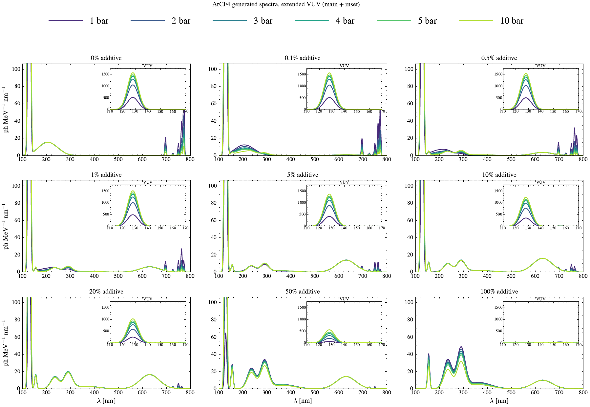
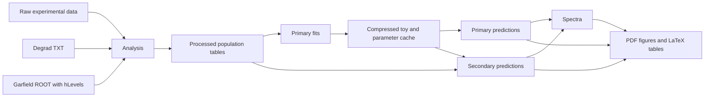
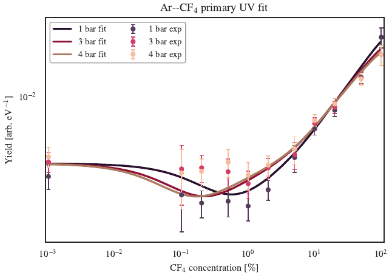

# ScintillationModel — rare-gas mixtures

Compact and reproducible framework for primary and secondary scintillation in rare-gas mixtures. The repository combines:

- microscopic populations from **Degrad** and **Garfield++**;
- kinetic models for Ar–CF₄, Ar–N₂, argon IR and the Ar second continuum;
- independent and joint fits with statistical and systematic toys;
- primary yields in ph/MeV and secondary yields in ph/e⁻;
- generated and experimental spectra;
- gain, reduced-field, effective-Townsend and charge-balance studies;
- publication-ready PDF figures and LaTeX tables.

<p align="center">
  
</p>

## User-facing entry points

The normal user-facing root of the repository remains intentionally small:

```text
README.md
run_all.sh
run_products.sh
```

There are no additional shell runners. The optional graphical control panel lives in `app/` and launches directly through Streamlit.

- `run_all.sh` controls analysis, fits and products.
- `run_products.sh` controls primary predictions, secondary predictions, spectra, tables and optional diagnostics.
- `python -m streamlit run app/main.py` opens the graphical interface.
- `README.md` explains the complete workflow and how to extend the physics.

The GUI is a thin layer over the same workflows: it edits the four canonical CSV figure registries and calls one of the two shell runners. It contains no independent copy of the physical models.

The `.vscode/` directory contains portable editor settings, optional C++ IntelliSense configuration and three tasks: run all, run products and open the graphical interface. It contains no personal absolute paths, historical notebooks, copied Magboltz sources or obsolete analysis scripts. The `.image/` directory contains the images used by this README. A local `.git/` directory is created by Git when the project is cloned or initialised and is never distributed inside the ZIP.

---

# Quick start

```bash
python3 -m venv .venv
source .venv/bin/activate
python -m pip install --upgrade pip
python -m pip install -r requirements.txt
```

Run the complete pipeline:

```bash
bash run_all.sh
```

The default is **100 statistical toys and 100 systematic toys** per fit:

```bash
PRIMARY_FIT_N_TOYS=300 bash run_all.sh
```

Regenerate figures and tables from existing processed data and fit caches:

```bash
bash run_products.sh
```

Open the graphical control panel:

```bash
python -m streamlit run app/main.py
```

The browser interface is local by default. It edits files inside the checked-out project and should therefore be launched from the repository root.

## Graphical interface

Launch the local control panel with:

```bash
python -m streamlit run app/main.py
```

The application deliberately edits the same configuration used by the terminal workflows. It has four stable areas:

1. **Run pipeline** — select analysis, fits, primary, secondary, spectra, tables and diagnostics; set toys; preview the exact command and stream the log.
2. **Figure recipes** — interactively edit the four canonical production registries: `fits.csv`, `primary.csv`, `secondary.csv` and `spectra.csv`.
3. **Outputs** — browse and download official PDFs and LaTeX tables by scientific family.
4. **Plot style** — edit typography, lines, axes, major/minor tick widths and lengths, uncertainty-band opacity, error bars, grid and legends.

The GUI does not contain a second implementation of the physics. Saving a figure recipe changes only the corresponding CSV; `run_all.sh` and `run_products.sh` read the same files.

## Selecting what to run

`run_all.sh` is the only full-pipeline runner:

```bash
# Analysis only
RUN_FITS=0 RUN_PRODUCTS=0 bash run_all.sh

# Fits only
RUN_ANALYSIS=0 RUN_PRODUCTS=0 bash run_all.sh

# Analysis + fits, without figures
RUN_PRODUCTS=0 bash run_all.sh

# Products only through the full runner
RUN_ANALYSIS=0 RUN_FITS=0 bash run_all.sh
```

`run_products.sh` is the only product runner:

```bash
# Primary predictions only
RUN_SECONDARY=0 RUN_SPECTRA=0 RUN_TABLES=0 bash run_products.sh

# Secondary predictions only
RUN_PRIMARY=0 RUN_SPECTRA=0 RUN_TABLES=0 bash run_products.sh

# Spectra only
RUN_PRIMARY=0 RUN_SECONDARY=0 RUN_TABLES=0 bash run_products.sh

# Tables only
RUN_PRIMARY=0 RUN_SECONDARY=0 RUN_SPECTRA=0 bash run_products.sh

# Optional cross-section, population and integral diagnostics
RUN_PRIMARY=0 RUN_SECONDARY=0 RUN_SPECTRA=0 RUN_TABLES=0 \
RUN_DIAGNOSTICS=1 bash run_products.sh
```

Useful switches:

```bash
RECOMPUTE_BANDS=1 bash run_products.sh
RECOMPUTE_TABLES=1 bash run_products.sh
EXPORT_SCAN_DATA=1 bash run_products.sh
ARCHIVE_OUTPUTS=1 bash run_all.sh
RUN_LOW_PRESSURE_PRIMARY=0 bash run_products.sh
RUN_JOINT_IR_PRIMARY=0 bash run_products.sh
```

After a fit, `run_all.sh` invalidates and recomputes both primary band caches and prediction-table caches automatically. Ordinary `run_products.sh` calls reuse those compact products. Set `RECOMPUTE_BANDS=1` or `RECOMPUTE_TABLES=1` only after changing model equations, normalisation logic or the underlying fitted products. Style-only and plot-row changes normally need neither.

---

# Pipeline



`run_all.sh` performs:

```text
analysis → fits → run_products.sh
```

`run_products.sh` never rereads Degrad or Garfield inputs and never refits parameters.

---

# Repository layout

```text
.image/                         images used only by this README
.vscode/                        portable settings, C++ IntelliSense and execution tasks
app/                            Streamlit control panel
config/                         small editable registries
├── mixtures.csv
├── channels.csv
├── fits.csv
├── normalizations.csv
├── ocw.csv
├── primary_population_groups.csv
├── secondary_inputs.csv
├── population_groups.csv
├── secondary_parameter_sets.csv
├── secondary_selections.csv
├── experimental_datasets.csv
├── spectral_components.csv
├── plots/
│   ├── fits.csv
│   ├── primary.csv
│   ├── secondary.csv
│   └── spectra.csv
└── styles/                    reusable global plot presets

data/
├── raw/                        immutable original inputs
│   ├── experimental/
│   ├── degrad/
│   ├── garfield/
│   └── spectra/
├── processed/                  compact tables read by models
│   ├── experimental/
│   ├── primary/
│   ├── secondary/
│   └── spectra/
├── reference/                  literature and shared reference data
│   ├── levels/
│   ├── parameters/
│   ├── cross_sections/
│   ├── thresholds/
│   └── annotated_input/
└── cache/                      reusable generated numerical products
    ├── fits/
    ├── predictions/
    ├── secondary/
    ├── spectra/
    ├── tables/
    └── parameters/

src/scintillation/
├── core/                       paths, runtime and output handling
├── io/                         hLevels and population mapping
├── physics/                    shared model and parameter infrastructure
├── fitting/                    compressed toy cache
├── predictions/                normalisation, scans and result contracts
├── plotting/                   shared visual style and semantics
├── reporting/                  compact table exporters
└── legacy/project/             validated explicit physics modules

workflows/                      Python stages called by the two runners
outputs/
├── figures/
│   ├── fits/
│   ├── primary/
│   ├── secondary/
│   ├── spectra/
│   └── diagnostics/
└── tables/

docs/                           architecture and validation notes
```

The generated `.runtime/` directory is a compatibility workspace. Do not edit it. It lets the validated historical modules operate against the compact canonical data layout.

---

# What is already available

| Area | Current products |
|---|---|
| Degrad primary analysis | populations, excitation/ionisation studies, Wexc, electron/X-ray comparisons |
| Primary fits | Ar–CF₄ UV/VIS, Ar–N₂ UV, independent Ar–CF₄ IR, independent Ar–N₂ IR, joint IR |
| Primary predictions | yields vs concentration and pressure, low-pressure extrapolations, individual/total components, stat/syst bands |
| Garfield secondary analysis | gain, gain resolution, electrons, ions, E, E/p, effective Townsend quantities, hLevels populations |
| Secondary predictions | integrated UV/VIS/IR/VUV yields, OCW transformations, GEM/THGEM/uniform-field comparisons |
| Spectra | raw, generated, comparison and annotated primary spectra; extended VUV spectra |
| Optional diagnostics | cross sections, population histograms, integral comparisons |
| Final outputs | PDF figures and LaTeX tables |

<p align="center">
  
  
  
</p>

---

# Input data

## Experimental yields and spectra

Put untouched experimental pickles in:

```text
data/raw/experimental/<Mixture>/
```

The analysis writes compact reusable tables to:

```text
data/processed/experimental/<Mixture>/
data/processed/spectra/
```

These tables are inputs to fits and spectrum generation. They are not copied to `outputs/`.

## Primary Degrad inputs

Put Degrad text files in:

```text
data/raw/degrad/<Mixture>/txt/
```

Population extraction is configured in:

```text
config/primary_population_groups.csv
```

Every row selects a population using:

```text
run_id
mixture_id
input_subdir
gas names and concentration variable
state-name tokens
gas
energy interval
output_name
```

Rows sharing a `run_id` are written to one compact table such as:

```text
data/processed/primary/ArCF4.csv
data/processed/primary/ArCF4_IR.csv
data/processed/primary/ArCF4_Ar2nd.csv
data/processed/primary/ArN2.csv
```

Use different `run_id` values when two models need different definitions of the populations. Do not merge them merely because they describe similar states.

## Electron/X-ray scans and Wexc

Degrad energy scans belong in:

```text
data/raw/degrad/photons/OUTPUTS/
data/raw/degrad/Electrons/OUTPUTS/
```

The analysis creates:

```text
data/processed/primary/electrons_xRay_energy_cases.csv
```

The primary workflow can then produce:

- channel yield versus incident energy;
- electron versus X-ray comparisons;
- pure-Ar and 99/1 Ar–CF₄ second-continuum comparisons;
- Wexc for Ar, Xe, CF₄ and N₂ when the corresponding cases exist.

The energy definition is:

```text
Wexc [eV] = 1000 × E[keV] / Nexc
```

## Garfield ROOT inputs

Put ROOT files in:

```text
data/raw/garfield/<Mixture>/root/
```

Declare each campaign in:

```text
config/secondary_inputs.csv
```

The analysis reads the ROOT metadata and `hLevels`, maps the required populations and writes compact aggregate secondary tables. It does not produce one CSV per ROOT.

---

# hLevels, cross sections and population histograms

## hLevels

A ROOT needs only the physical simulation objects, including `hLevels`. No redundant `LevelCatalogue` tree is required inside every ROOT.

The bin interpretation is stored once per compatible Magboltz level ordering in:

```text
data/reference/levels/<Mixture>_level_data.csv
```

Canonical population rules are stored in:

```text
config/population_groups.csv
```

A rule maps gas, state-name tokens and an energy interval to a population used by a model, for example:

```text
Ar_dbleStar
Ar_1s4_1s5
Ar_1s2_1s3
Ar_2nd_precursor
CF4
CF3
N2_star
Ar_696
```

The normal analysis keeps only the aggregate populations required later. Full hLevels inspection plots remain optional.

## Adding a new hLevels mapping

1. Generate one representative ROOT with the intended gas table and Garfield/Magboltz setup.
2. Export the ordered level definitions once to `data/reference/levels/<Mixture>_level_data.csv`.
3. Add the physical group rules to `config/population_groups.csv`.
4. Add the campaign to `config/secondary_inputs.csv`.
5. Run analysis:

```bash
RUN_FITS=0 RUN_PRODUCTS=0 bash run_all.sh
```

Do not copy the same level descriptions into every ROOT or create one mapping CSV per simulation.

## Cross sections

Included reference files live in:

```text
data/reference/cross_sections/
```

The retained Garfield++/Magboltz C++ source can regenerate a gas cross-section table when the development libraries are available. Existing reference tables can be plotted without recompiling C++.

Generate all optional diagnostics with:

```bash
RUN_PRIMARY=0 RUN_SECONDARY=0 RUN_SPECTRA=0 RUN_TABLES=0 \
RUN_DIAGNOSTICS=1 bash run_products.sh
```

Cross-section PDFs go to:

```text
outputs/figures/diagnostics/cross_sections/
```

<p align="center">
  
  
</p>

## Population histograms

The historical population-histogram diagnostic is retained and reads the shared processed populations. Its PDFs go to:

```text
outputs/figures/diagnostics/populations/
```

It is not run normally because it is an inspection product and is not consumed by predictions.

---

# Fits, toys and uncertainties

The active fit identities are separate:

```text
ArCF4_primary
ArN2_primary
ArCF4_IR_primary
ArN2_IR_primary
ArJoint_IR_primary
```

Analogous parameters from different fits may be compared but are not silently merged or substituted.

Fit caches used by predictions live in:

```text
data/cache/fits/products/
├── <fit>_central.csv
├── <fit>_covariance.csv
├── <fit>_correlation.csv
└── <fit>_toys.npz
```

The compressed NPZ contains the parameter names and the stat/syst toy matrices. Predictions load it once per process and reuse it. Large intermediate toy CSVs are removed after the fit products have been collected.

Supported uncertainty products include:

- statistical bands;
- systematic bands;
- stat ⊕ syst bands;
- asymmetric percentile bands;
- channel-specific OCW envelopes;
- combined secondary uncertainty sources.

Cached bands live under:

```text
data/cache/predictions/
```

---

# Normalisations and OCW

Normalisation recipes are declared in:

```text
config/normalizations.csv
```

Typical modes are:

| ID | Meaning |
|---|---|
| `ArCF4` | common reference from the Ar–CF₄ primary fit |
| `ArN2` | reference from the Ar–N₂ primary fit |
| `own` | use the same model's fitted normalisation |
| `absolute` | model already returns an absolute yield |
| `as_fit` | preserve the fitted optical convention |

All active OCW modifications are stored in:

```text
config/ocw.csv
```

Changing an OCW does not require a new fit:

```bash
RUN_PRIMARY=0 RUN_SPECTRA=0 bash run_products.sh
```

---

# Secondary catalogue and generic scans

The compact Garfield catalogue is stored at:

```text
data/cache/secondary/simulation_catalog.csv.gz
```

It contains the available mixture/campaign, geometry, pressure, gap, E, E/p, concentration, electron/ion populations, gain, resolution, effective Townsend quantities and canonical hLevels populations.

All secondary figures—including generic transport scans—are now registered in:

```text
config/plots/secondary.csv
```

A `plot_type=scan` row can use any catalogue column as X, Y, curve or facet. Existing rows reproduce gain versus E, gain versus E/p, alpha_eff/p versus E/p, resolution versus gain, charge imbalance versus E/p and ion/electron ratio versus gain. Numerical rows behind these figures are exported only with:

```bash
EXPORT_SCAN_DATA=1 RUN_PRIMARY=0 RUN_SPECTRA=0 bash run_products.sh
```

# How to extend the physics

This is the most important distinction in the repository. “Adding a model” can mean four different things, and each requires a different amount of work.

| What you want | What normally changes |
|---|---|
| Another plot or table from an existing quantity | recipe/config only |
| Another peak handled by an existing kinetic family | population + equation + active component registration |
| A new emission channel or continuum | population + physical model + parameters/fit + prediction adapter + spectrum |
| A completely new mixture | mixture registration + raw data + populations + models + parameters + outputs |

Do not create a new fit or duplicate a model when the desired result is only a different plot.

## Anatomy of a complete physical model

A model is complete only when the required layers below exist. Not every channel needs every layer.

### 1. Population input

The model must receive the microscopic population that feeds it:

```text
Degrad population → config/primary_population_groups.csv
Garfield hLevels population → config/population_groups.csv
```

### 2. Physical equation

The function must convert populations and parameters into a yield. Current validated explicit equations live in:

```text
src/scintillation/legacy/project/models/
```

Shared newer infrastructure, such as additive-aware second-continuum parameters, lives in:

```text
src/scintillation/physics/
```

A new equation should have a stable component name and return the same unit convention as its adapter expects.

### 3. Parameter source

Parameters must come from exactly one declared source:

- a fitted parameter vector;
- a literature/reference CSV;
- a deterministic transformation such as an OCW rule.

Never fetch an unrelated fit simply because its parameter names look similar.

### 4. Fit, when needed

A fitted model needs:

- experimental input;
- parameter names, initial values and bounds;
- dataset definitions and masks;
- equations associated with each dataset;
- stat/syst toy policy;
- fit plots and parameter table;
- registration in `config/fits.csv`;
- inclusion in `src/scintillation/legacy/project/primary_fits/run_primary_fits.py`.

A literature-only channel does not need a fit.

### 5. Primary prediction adapter

To expose a fitted or absolute component to generic primary predictions, register it in:

```text
src/scintillation/legacy/project/primary_predictions/configs.py
```

The `PRIMARY_ADAPTERS` entry declares:

```text
fit name
processed Degrad table
component name → equation
normalisation recipe
```

### 6. Secondary parameter recipe

For secondary light, register the exact physical recipe in:

```text
config/secondary_parameter_sets.csv
```

It declares:

```text
mixture
channel
model
base fit or literature family
normalisation
OCW
parameter transformation
uncertainty sources
```

### 7. Channel registration

Register the wavelength region and availability in:

```text
config/channels.csv
```

This is where a component becomes a named primary/secondary channel rather than an internal function.

### 8. Spectral shape

Register the component in:

```text
config/spectral_components.csv
```

Then connect its wavelength shape in:

```text
src/scintillation/legacy/project/spectra/auxiliares/generated.py
```

A channel can have a valid integrated yield before a spectral shape is implemented. In that case it can appear in yield plots and tables but not in a generated full spectrum.

### 9. Register its figures

Once the physical quantity exists, no dedicated plotting function should be added. Register rows in one of:

```text
config/plots/fits.csv
config/plots/primary.csv
config/plots/secondary.csv
config/plots/spectra.csv
```

The output layer selects components, experimental datasets, masks, normalisation, uncertainty bands and layout; it never contains a second copy of the physical equation. Detailed schemas and examples are in [`docs/PLOT_RECIPES.md`](docs/PLOT_RECIPES.md).

# Example A — add another argon IR peak

Suppose you want to include a new argon line at wavelength `XXX` nm in the existing IR family.

## A1. Extract its population

Add one row for every relevant mixture to:

```text
config/primary_population_groups.csv
```

with an output such as:

```text
Ar_XXX
```

Run analysis and verify that `Ar_XXX` appears in the corresponding processed IR table.

## A2. Add the line equation

Add a function such as:

```text
theory_yield_ArCF4_Ir_XXX
theory_yield_ArN2_Ir_XXX
```

in the appropriate IR model module:

```text
src/scintillation/legacy/project/models/ArCF4_infrarred.py
src/scintillation/legacy/project/models/ArN2_infrarred.py
```

Reuse the existing family structure only when the same precursor, lifetime and quenching equation are physically justified.

## A3. Activate it in the fit

In the corresponding fit module:

```text
src/scintillation/legacy/project/primary_fits/ArCF4_IR_fit.py
src/scintillation/legacy/project/primary_fits/ArN2_IR_fit.py
```

update all of the following:

```text
IR_LINES
EQUATIONS
parameter construction
experimental dataset path
plot generation
systematic-source list
```

Most of these are already derived from `IR_LINES`, so adding the line there and to `EQUATIONS` activates the repeated fit machinery.

## A4. Activate primary predictions

Add the component to the relevant `PRIMARY_ADAPTERS` entry in:

```text
src/scintillation/legacy/project/primary_predictions/configs.py
```

and include it in the `total` sum when desired.

## A5. Register the named channel

Add a row to:

```text
config/channels.csv
```

with its wavelength window and primary/secondary availability.

## A6. Add it to generated spectra

Import the equation and add its central wavelength in:

```text
src/scintillation/legacy/project/spectra/auxiliares/generated.py
```

Then add or update its row in:

```text
config/spectral_components.csv
```

## Concrete current example: 794 nm

The current repository already extracts `Ar_794` and contains 794-nm theory functions, but **794 nm is not part of the active IR fit lists, primary adapter totals, channel registry or generated spectra**. To activate it completely, follow A3–A6. This is a useful example of the difference between “the equation exists” and “the component is fully integrated”.

After changing the fit model:

```bash
bash run_all.sh
```

---

# Example B — add helium IR peaks

Helium IR is not simply “another argon line”. It is a new emitting species and should be treated as a separate physical model.

## B1. Register the mixture

Add the required He-based mixture to:

```text
config/mixtures.csv
```

For example, a future He–CF₄ entry should define He as the base gas and CF₄ as the additive. Do not point it to the Ar IR fit.

## B2. Add Degrad populations

Put the raw inputs in:

```text
data/raw/degrad/HeCF4/txt/
```

Add one `run_id` group in:

```text
config/primary_population_groups.csv
```

for the He upper states that feed the selected IR transitions.

## B3. Create the helium kinetic model

Create a dedicated model module and equations for the actual He states, radiative lifetimes, transfer channels and quenching rates. Do not copy the Ar equation with renamed variables unless the derivation is genuinely the same.

## B4. Add a dedicated fit or literature parameter source

If experimental line yields exist, add a new fit configuration and register it in:

```text
config/fits.csv
src/scintillation/legacy/project/primary_fits/run_primary_fits.py
```

If all parameters are adopted from literature, store them once in `data/reference/parameters/` and use an absolute/literature parameter family instead.

## B5. Expose predictions and spectra

Add:

```text
PRIMARY_ADAPTERS entry
config/channels.csv rows
config/secondary_parameter_sets.csv rows when secondary light is supported
config/spectral_components.csv rows
wavelength shapes in generated.py
```

Only then should He IR appear in primary tables, secondary comparisons or full spectra.

---

# Example C — add a new N₂ continuum

Suppose you want to model a previously absent N₂ “sixth continuum”. This is a new emission channel, even if it uses the existing Ar–N₂ mixture.

## C1. Define the physical population

Identify the Degrad or Garfield states that feed the continuum. Add a dedicated output population to:

```text
config/primary_population_groups.csv
config/population_groups.csv
```

Use separate names for primary and secondary populations if their definitions differ.

## C2. Define the kinetic yield

Implement a component function with a clear name, for example:

```text
n2_sixth_continuum
```

The equation should explicitly contain its production, radiative, transfer and quenching terms.

## C3. Decide how parameters are obtained

Choose one:

```text
fit to experimental data
literature parameters
fixed/derived parameters with uncertainty
```

Register a fit only when data constrain it. Otherwise use a reference parameter family.

## C4. Register the channel

Add a row to:

```text
config/channels.csv
```

with:

```text
channel_id
model_id
parameter_family
wavelength range
primary_enabled
secondary_enabled
default normalisation
status
```

## C5. Connect primary and/or secondary predictions

For primary predictions, add the component to the Ar–N₂ primary adapter.

For secondary predictions, add an exact row to:

```text
config/secondary_parameter_sets.csv
```

and ensure the required Garfield population exists.

## C6. Add the spectral shape

Add the continuum shape to the generated-spectrum code and register it in:

```text
config/spectral_components.csv
```

A continuum normally needs a wavelength distribution, not a single Gaussian peak, unless that approximation is justified.

## C7. Add requested products

Only now add the desired plots and tables. Typical products are:

```text
yield vs concentration
yield vs pressure
yield vs E or E/p
yield vs gain
primary/secondary spectral contribution
integrated wavelength-window table
```

---

# Adding a completely new mixture

A new mixture is a composition of existing or new models. Use this sequence.

## 1. Register it

Add a row to:

```text
config/mixtures.csv
```

Start with `status=planned`. Change to `active` only when the required inputs and models exist.

## 2. Add raw primary data

```text
data/raw/degrad/<Mixture>/txt/
data/raw/experimental/<Mixture>/
```

Add the necessary Degrad population groups.

## 3. Add or reuse physical channels explicitly

For every channel, decide whether it is:

- genuinely reusable with the same equation and parameters;
- reusable with different parameters;
- or a new model.

Declare this explicitly. Never reuse Ar–CF₄, Ar–N₂ or joint-fit parameters implicitly.

## 4. Add Garfield campaigns

```text
data/raw/garfield/<Mixture>/root/
config/secondary_inputs.csv
```

## 5. Add the single shared hLevels mapping

```text
data/reference/levels/<Mixture>_level_data.csv
config/population_groups.csv
```

## 6. Add quenching rates, lifetimes and branching ratios

Reference parameters belong in:

```text
data/reference/parameters/
```

Each row should contain value, uncertainty where available, unit, source, description and activation status.

For an additive-enabled Ar second continuum, add the required additive rows to the existing second-continuum parameter table rather than branching on the gas name in Python.

## 7. Register prediction recipes

```text
config/channels.csv
config/secondary_parameter_sets.csv
config/spectral_components.csv
```

## 8. Add outputs

Add rows to the corresponding `config/plots/*.csv`. Experimental data are named once in `config/experimental_datasets.csv`; secondary simulation masks are named once in `config/secondary_selections.csv`. Tables continue to read canonical fit/prediction/reference products and are classified automatically under `outputs/tables/{fits,primary,secondary,spectra,reference}`.

## 9. Validate before activation

Run:

```bash
PYTHONPATH=src pytest -q
bash run_all.sh
```

Check at least:

```text
processed populations
fit convergence and parameter bounds
stat/syst bands
normalisation
primary and secondary limiting cases
spectral integral versus integrated yield
interpolation/extrapolation range
```

---

# Adding outputs without adding a model

The plotting system is configuration-driven. Rows sharing `plot_id` are drawn in one PDF; each row is a model component, combined component, experimental dataset or simulation layer. The distributed registries contain 30 fit diagnostics, 31 primary figure recipes, 22 secondary figure recipes and 22 spectral figure recipes, reproducing the current production families while remaining editable from the GUI.

## New fit diagnostic

Add or duplicate a row in `config/plots/fits.csv`. Fit points always display statistical error bars; select dataset/component, pressure grid, labels, scales and output.

## New primary prediction

Add a row to `config/plots/primary.csv`. Select the model component, pressure, normalisation and bands. The `datasets` field references stable IDs from `config/experimental_datasets.csv`; X-ray data can follow or ignore the chosen normalisation through `scale_xray_with_normalization`.

## New secondary yield or transport plot

Add rows to `config/plots/secondary.csv`. Use `kind=model` for one light component, `kind=combined` with `components=model:component:band_mode:ocw|...` for sums, `kind=experimental` for a registered dataset, or `plot_type=scan` for catalogue quantities such as gain, E/p and alpha_eff/p.

## New spectrum

Add a row to `config/plots/spectra.csv`. Concentrations become panels, pressures become curves, and the row controls mosaic dimensions, wavelength range, shared y scale, optional inset, optional broken-x view and output.

## New literature table

Store literature numbers once in a reference CSV and let the table exporter read it. Do not duplicate parameter values in plotting or reporting source code.

# Spectra

The spectrum workflow is completely selected by `config/plots/spectra.csv`. The populated registry reproduces the current raw Ar–CF4/Ar–N2 mosaics, generated spectra, extended VUV spectra, inset and broken-x variants, raw-versus-generated comparisons and annotated family.

Generated numerical spectra remain in `data/cache/spectra/`; final PDFs are collected under `outputs/figures/spectra/`. To add a new component, first expose its integrated model output and wavelength shape, then list its stable component name in the recipe.

# Plot style

Reusable presets live in `config/styles/` and are applied to both modern and legacy-compatible renderers. The active preset is named in `config/styles/active.txt`. The GUI can edit:

- typography and figure dimensions;
- primary/secondary line widths and marker size;
- axis-spine width;
- major/minor tick width, length and direction;
- top/right ticks;
- uncertainty-band opacity;
- error-bar and cap thickness;
- grid opacity/width;
- legend frame, opacity and columns.

A one-off run can override the active preset:

```bash
SCINTILLATION_STYLE_PRESET=presentation bash run_products.sh
```

# Output policy

Normal execution creates only:

```text
outputs/figures/**/*.pdf
outputs/tables/**/*.tex
```

Reusable numerical products remain in:

```text
data/processed/
data/cache/
```

Optional numerical exports are disabled unless requested.

---

# GitHub-ready workflow

The ZIP can replace the working repository after a local validation run. Recommended first import:

```bash
git checkout -b compact-architecture
# Copy the contents of this project into the repository.
PYTHONPATH=src pytest -q
bash run_all.sh
```

Review the main PDFs and tables before merging into the default branch. Keep the previous repository state in Git history rather than as duplicated folders inside this project.

Do not commit:

```text
.runtime/
outputs/archive/
Python bytecode
local virtual environments
large local Garfield campaign payloads
```

`.gitignore` excludes the conventional local campaign folders but cannot filter by file size. Before a large commit, run:

```bash
python tools/check_large_files.py --staged
```

The default 90 MiB guard leaves margin below GitHub's 100 MiB normal-Git limit. Keep full ROOT campaigns outside normal Git or use Git LFS deliberately; small reference ROOT files may remain tracked.

The compact `data/cache/` currently distributed with the project is intentionally useful: it lets `run_products.sh` redraw products without repeating expensive fits. Keep or regenerate these caches according to the repository data policy; remove only stale caches, not the entire mechanism. Raw scientific inputs are likewise tracked according to the project data policy.

---

# Validation and current limitations

Run tests with:

```bash
PYTHONPATH=src pytest -q
```

The tests verify the four canonical figure registries, output and dataset references, fit statistical-error contracts, primary normalisation switches, joint-IR and annotated-spectrum coverage, parameter-scope separation, pipeline command generation and global style loading.

Current explicit limitations:

- full secondary spectral synthesis is not connected for every integrated secondary channel;
- CO₂, CH₄ and isobutane mappings and kinetic parameters remain planned until real simulations and literature inputs are supplied;
- charge-imbalance observables are diagnostic proxies until the Garfield counting convention is validated for each campaign;
- the GUI edits only registered figure rows and existing physical selections; it does not create missing simulations, models or hLevels mappings;
- adding a genuinely new physical model still requires an equation and an explicit adapter/fit registration; configuration files alone cannot invent the physics.

Architecture details and the validation record are available in:

```text
docs/ARCHITECTURE.md
docs/VALIDATION.md
```
